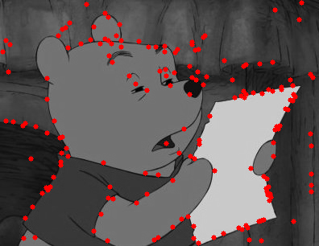
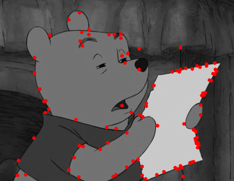
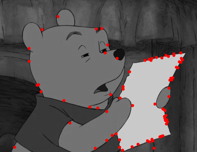

# DoG Experiment

|⚠️WARNING|
|---|
|This public repository is just for my personal portfolio. The content is for the course: ***Computer Vision: from recognition to geometry, Spring 2023, EE, NTU***. If you are taking this course right now, any form of referring or copying is ***not allowed***. Please finish your assignment by yourself.|

|Author|OS|Language|
|--|--|--|
|沈韋辰|Ubuntu 22.04.2 LTS|Python|

## Introduction
This program will display the procedure of DoG (Differenece of Gaussian) in SIFT and how to use it to find keypoints.

## Experiment 1
Use `python3 part1.py` to get the DoG images. (2 octaves, 4 layers in per octave)
| Argument                | Description                                           |
| ---------------------| ----------------------------------------------------- |
| `--image_path`        | Path to input image                                    |
| `--out_dir`           | Path to output directory                              |
| `--threshold`         | Threshold value for feature selection                 |

|Octave|Layer 1|Layer 2|Layer3|Layer 4|
|-|-|-|-|-|
|Octave 1|||||
|Octave 2|||||

## Experiment 2
Use `python3 part2.py` to get the keypoint in different threshold.
| Argument                | Description                                           |
| ---------------------| ----------------------------------------------------- |
| `--image_path`        | Path to input image                                    |
| `--out_dir`           | Path to output directory                              |

|Threshold|Image|
|-|-|
|1||
|2||
|3||